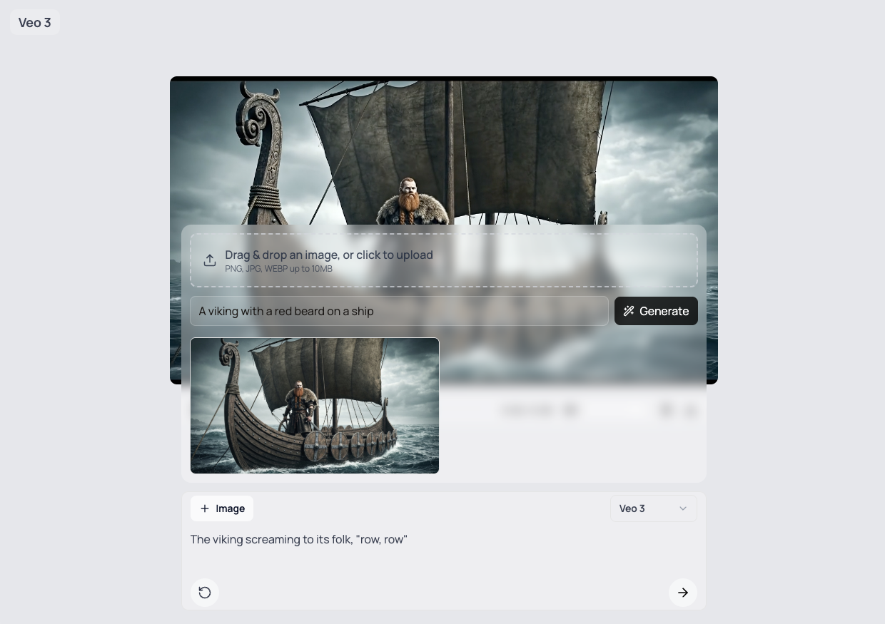

# 🎬 Veo 3 Studio Pro - Unified Edition

> **This is now a unified, production-ready application combining the best features of Veo Studio and Gallery!**

[Veo 3](https://ai.google.dev/gemini-api/docs/video) is Google's state-of-the-art video generation model. This application provides a comprehensive, beautiful UI for generating videos with **multiple generation modes**, **persistent gallery**, **video editing**, and **image generation** using both Veo 3 and [Imagen 4](https://ai.google.dev/gemini-api/docs/imagen).



## ⚡ Quick Start

```bash
npm install
# Create .env.local with: GEMINI_API_KEY="your-key"
npm run dev
```

**📖 [Complete Setup Guide →](./SETUP-GUIDE.md)**  
**📚 [Full Documentation →](./README-UNIFIED.md)**

(This is not an official Google product.)

## ✨ Features

### Video Generation
-   **Text to Video**: Generate from text descriptions
-   **Image to Video**: Animate images with AI
-   **Frames to Video**: Interpolate between start/end frames
-   **References to Video**: Use reference images for consistent style
-   **Video Extension**: Continue existing videos (coming soon)

### Image & Editing
-   **Imagen 4 Integration**: Generate images inline
-   **Video Trimming**: Cut videos in-browser to specific time ranges
-   **Multiple Models**: Veo 3.0, 3.1, Fast variants
-   **Advanced Controls**: Aspect ratio, resolution, negative prompts

### Gallery & Storage
-   **Persistent Gallery**: IndexedDB storage (survives page refresh)
-   **Grid/List Views**: Flexible viewing modes
-   **Filter & Sort**: By type, date, or model
-   **Download & Manage**: Full control over your content

## Getting Started: Development and Local Testing

Follow these steps to get the application running locally for development and testing.

**1. Prerequisites:**

-   Node.js and npm (or yarn/pnpm)
-   **`GEMINI_API_KEY`**: The application requires a [GEMINI API key](https://aistudio.google.com/app/apikey). Either create a `.env` file in the project root and add your API key: `GEMINI_API_KEY="YOUR_API_KEY"` or set the environment variable in your system.

> [!WARNING]  
> Google Veo 3 and Imagen 4 are both part of the Gemini API Paid tier. You will need to be on the paid tier to use these models.

**2. Install Dependencies:**

```bash
npm install
```

**3. Run Development Server:**

```bash
npm run dev
```

Open your browser and navigate to `http://localhost:3000` to see the application.

## 🏗️ Architecture Improvements

This unified version includes:

### State Management
-   **React Context API**: Clean, type-safe state management
-   **VideoGenerationContext**: Handles all generation parameters
-   **GalleryContext**: Manages gallery + IndexedDB persistence

### Enhanced Features
-   **Multiple Generation Modes**: Text, Image, Frames, References
-   **IndexedDB Persistence**: Gallery survives page refreshes
-   **Error Boundaries**: Graceful error handling
-   **Optimized API Routes**: Support for all generation modes
-   **Type Safety**: Comprehensive TypeScript definitions

### Project Structure

```
app/
├── api/              # Backend API routes (server-side)
│   ├── imagen/       # Image generation
│   └── veo/          # Video generation (all modes)
├── page.tsx          # Main unified application
└── layout.tsx        # Root with error boundary

components/
├── ui/               # UI components
│   ├── UnifiedComposer.tsx   # Multi-mode input
│   ├── VideoPlayer.tsx       # Player with trimming
│   └── VeoGallery.tsx        # Gallery management
└── ErrorBoundary.tsx         # Error handling

contexts/             # State management
├── VideoGenerationContext.tsx
└── GalleryContext.tsx

types/                # TypeScript definitions
└── index.ts

lib/                  # Utilities
└── utils.ts
```

## Official Docs and Resources

-   Gemini API docs: `https://ai.google.dev/gemini-api/docs`
-   Veo 3 Guide: `https://ai.google.dev/gemini-api/docs/video?example=dialogue`
-   Imagen 4 Guide: `https://ai.google.dev/gemini-api/docs/imagen`

## How it Works

The application uses the following API routes to interact with the Google models:

-   `app/api/veo/generate/route.ts`:  Handles video generation requests. It takes a text prompt as input and initiates a video generation operation with the Veo-3 model.
-   `app/api/veo/operation/route.ts`: Checks the status of a video generation operation.
-   `app/api/veo/download/route.ts`:  Downloads the generated video.
-   `app/api/imagen/generate/route.ts`: Handles image generation requests with the Imagen model.

## Technologies Used

-   [Next.js](https://nextjs.org/) - React framework for building the user interface.
-   [React](https://reactjs.org/) - JavaScript library for building user interfaces.
-   [Tailwind CSS](https://tailwindcss.com/) - For styling.
-   [Gemini API](https://ai.google.dev/gemini-api/docs) with Veo 3 - For video generation; Imagen - For image generation.

## Questions and feature requests

-   **Want a feature?** Please open an issue describing the use case and proposed behavior.

## License

This project is licensed under the Apache License 2.0.
